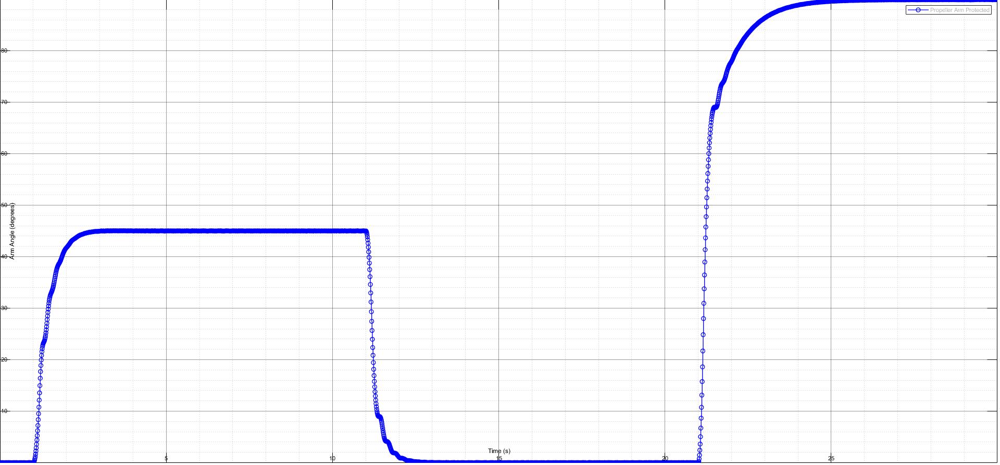

# Propeller Arm Control
A PID based propeller arm control scheme is implemented in MATLAB/SIMULINK environment.
The propeller arm is designed to look like a windmill and only rotates in one direction, eliminating any means to decelerate other than gravitational force and friction.
Performance metrics of the implementation are presented below.

|                     |    0° to 45°    |    45° to 0°     |    0° to max°     |
|---------------------|-----------------|-------------------------------------|---------------------------------------------------|
| Angle Furthest Away from the Initial Angle In Transient Response (degrees) | 44.9535 (0 overshoot) | 0.006505 (0 undershoot) | Does not apply |
| Settling Time (s) | 1.38 | 1.03 | 3.13 |
| SSTE (degrees) | 0.09600 | 0.10009 | 0.14021 |
| Max Angle w/o Tipover (degrees) | Does not apply | Does not apply | 89.92 (higher angles cause tip-over) |

The model in the source folder only includes the controller since the model for propeller arm is not my intellectual property.

